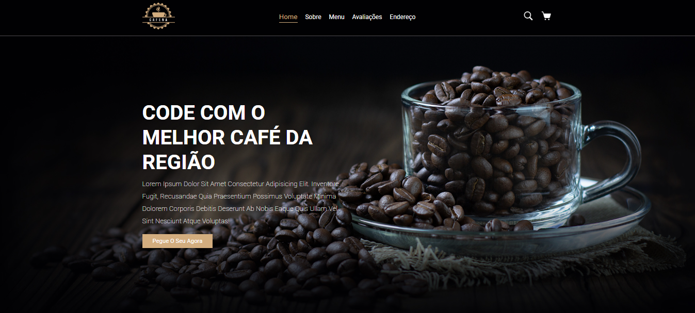
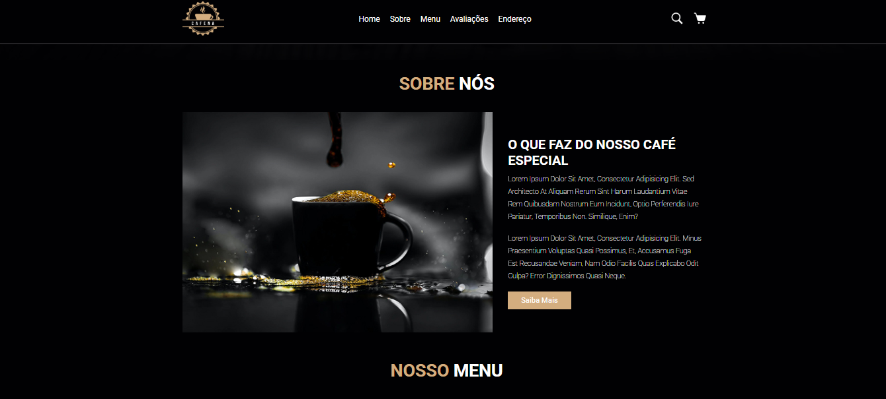
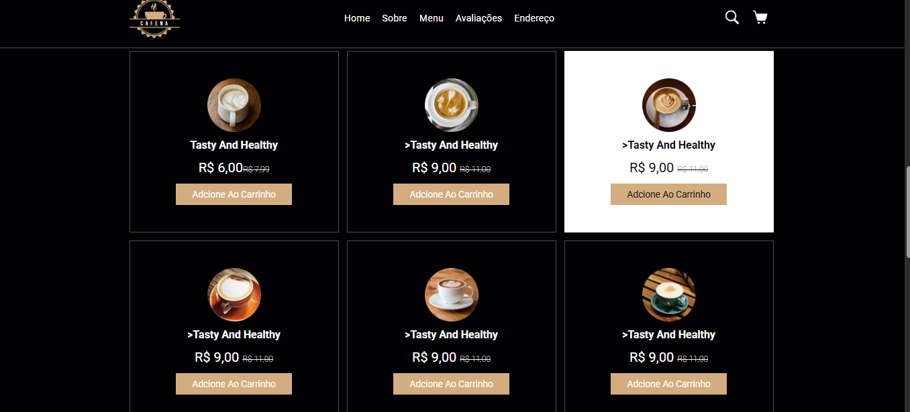
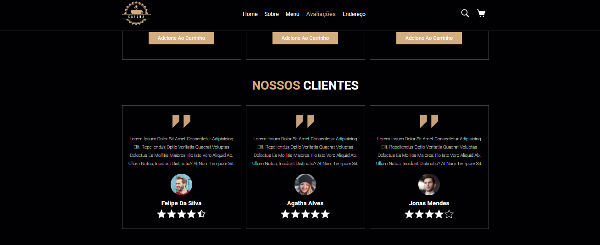
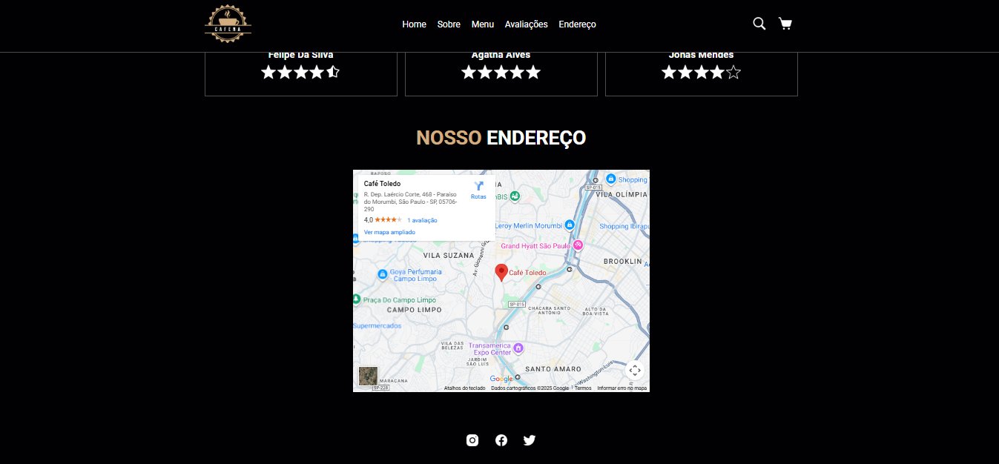

# ☕ DevClub Coffee

Projeto desenvolvido com o objetivo de praticar **HTML e CSS**, seguindo aulas do **DevClub**.  
O site representa uma cafeteria fictícia e foi criado como parte do aprendizado inicial em desenvolvimento front-end.

---

## 📌 Sobre o Projeto

O DevClub Coffee é um site estático desenvolvido utilizando apenas **HTML e CSS**, com foco na prática de estruturação de páginas, estilização e organização visual do conteúdo.

---

## 🛠️ Tecnologias Utilizadas

- HTML5  
- CSS3  
- Google Fonts  
- Flexbox  
- Grid Layout  

---

## 📄 Estrutura do Site

- **Home**: apresentação inicial da cafeteria  
- **Sobre Nós**: informações sobre o café  
- **Menu**: cardápio com produtos e preços  
- **Avaliações**: comentários de clientes  
- **Endereço**: localização com mapa  
- **Rodapé**: links para redes sociais  

---

## 🖼️ Preview do Projeto

### Página Inicial

### Sobre Nós

### Menu

### Avaliações

### Endereço

---

## 🎯 Objetivo do Projeto

Este projeto tem como objetivo reforçar os conceitos básicos de desenvolvimento web, trabalhando estruturação de páginas, estilização e layout responsivo utilizando apenas HTML e CSS.

---

## 📚 Aprendizados

Durante o desenvolvimento deste projeto, foram praticados conceitos como:
- Estruturação semântica com HTML
- Estilização com CSS
- Organização de layout com Flexbox e Grid
- Boas práticas iniciais de front-end

---

## 👩‍💻 Desenvolvido por

**Lara Rodrigues**  
Projeto desenvolvido como prática de HTML e CSS no DevClub.
